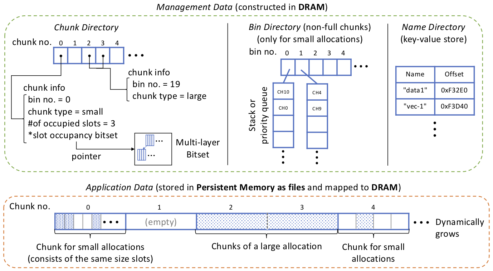

## Overview

To efficiently manage memory allocations without a complex architecture,
Metall exploits one of the main design philosophies of [SuperMalloc](https://dl.acm.org/doi/10.1145/2887746.2754178)
— virtual memory (VM) space on a 64-bit machine is relatively cheap, but physical memory is dear.

More specifically, we take advantage of *uncommitted* page (memory),
that is, physical memory space both in DRAM and persistent memory is not consumed until the corresponding pages are accessed.

The figure below is the internal architecture of Metall

### Backing Data Store
Metall uses multiple files to store application data.
We found that breaking application data into multiple backing files increase parallel I/O performance, e.g., we achieved an around 5X improvement in our preliminary evaluation (multi-threaded out-of-core sort) on a PCIe NVMe SSD device.
To efficiently use persistent memory resources, Metall creates and maps new files on demand.

### Segment and Chunk
Metall *reserves* a large contiguous virtual memory (VM) space (e.g., a few TB) to map backing file(s) when its manager class is constructed.
Metall divides the reserved VM space into *chunks* (the default chunk size is 2 MB).
Each chunk can hold multiple *small objects* (8B–half chunk size) of the same allocation size.
Objects larger than the half chunk size (*large objects*) use a single or multiple contiguous chunks.

By default, Metall frees DRAM and file space by chunk, that is,
small object deallocations do not free physical memory immediately, whereas large object deallocations do.
Metall also has a mode that tries to free the corresponding space when an object equal or larger than *N* bytes is deallocated,
where N is set by the compile time option (macro) *METALL_FREE_SMALL_OBJECT_SIZE_HINT=N* (see [Build and Install](../basics/compile_time_options.md)).

### Internal Allocation Size
Same as other major heap memory allocators, Metall rounds up a small object to the nearest internal allocation size.
Metall uses allocation sizes proposed by [SuperMalloc](https://dl.acm.org/doi/10.1145/2887746.2754178)  and [jemalloc](http://jemalloc.net/).
Thanks to this approach, Metall can keep internal fragmentations equal to or less than 25 % and convert a small object size to the corresponding internal allocation size quickly.
On the other hand, a large object is rounded up to the nearest power of 2
— although this strategy wastes VM space, it does not waste physical memory thanks to the uncommitted page.

### Management Data
Metall uses three types of management data as follows to manage memory allocations.

* Bin Directory is an array of *bins*. Each bin holds non-full chunk IDs of the same internal allocation size. This directory is used to find an available chunk for a small allocation quickly.

* Chunk Directory is an array whose *i*-th element holds the status of the *i*-th chunk.
To efficiently find an empty slot in a chunk used for a small size,
Metall utilizes a compact multi-layer bitset table and built-in bit operation functions.

* Name Directory is a simple key-value store used to store the keys and addresses of constructed objects.

Because updating the management data causes fine-grained random memory accesses,
Metall constructs them in DRAM to increase data locality; hence, Metall does not touch persistent memory when allocates memory.
Metall deserializes/serializes the management data from/to files when its constructor/destructor is called.
