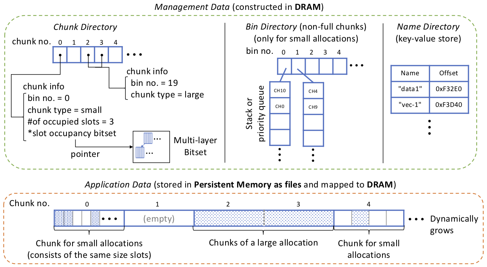

# Overview

Metall's internal design follows one of the key ideas from
[SuperMalloc](https://dl.acm.org/doi/10.1145/2887746.2754178): on a 64-bit
system, virtual address space is relatively cheap, while physical memory and
storage bandwidth are more valuable.

Metall therefore reserves a large virtual address range and consumes physical
memory only when pages are actually touched. This keeps the allocator simple and
lets applications work with large mapped datasets.

The figure below shows Metall's internal architecture.

## Why This Matters to Users

Understanding the architecture helps explain three user-visible behaviors:

- Reopening a datastore does not require objects to live at the same virtual
  address, which is why persistent objects must use offset pointers.
- Small deallocations do not necessarily release file space immediately because
  Metall manages backing space at chunk granularity.
- Metall's management metadata lives in DRAM during execution and is
  serialized when the datastore is closed or snapshotted.

### Backing Data Store

Metall uses multiple files to store application data. Splitting the datastore
across multiple backing files can improve parallel I/O performance, especially
for large workloads. New files are created and mapped on demand.

### Segment and Chunk

When a manager is constructed, Metall reserves a large contiguous region of
virtual memory, often on the order of terabytes. This reservation does not mean
that physical memory is committed immediately.

Metall divides that address range into chunks. The default chunk size is 2 MB.
Each chunk can hold multiple small objects of the same internal allocation
size. Objects larger than half a chunk are treated as large objects and occupy
one or more contiguous chunks.

By default, Metall reclaims DRAM and file space at chunk granularity. As a
result, freeing a small object usually does not release backing space
immediately, while freeing a large object can. Metall also provides a compile
time hint, `METALL_FREE_SMALL_OBJECT_SIZE_HINT=N`, to try to release space more
aggressively for deallocations at or above a chosen size. See
[Compile-time options](../basics/compile_time_options.md).

### Internal Allocation Size

Like other high-performance allocators, Metall rounds small allocations up to
internal size classes. These size classes are influenced by ideas from
[SuperMalloc](https://dl.acm.org/doi/10.1145/2887746.2754178) and
[jemalloc](http://jemalloc.net/), which helps bound internal fragmentation and
keep size-class lookup fast.

Large objects are rounded up differently. This may consume more virtual address
space, but thanks to uncommitted pages it does not imply proportional physical
memory usage.

### Management Data

Metall uses three kinds of management data to manage allocations.

- The Bin Directory stores non-full chunk IDs for each internal allocation
  size, which makes small allocations fast.
- The Chunk Directory tracks the state of each chunk and uses a compact
  multi-layer bitset to find free slots efficiently.
- The Name Directory is a simple key-value store that maps object names to
  their locations.

Because these structures are updated frequently and involve fine-grained random
accesses, Metall keeps them in DRAM while the datastore is open. On open,
Metall reconstructs them from files, and on clean close or snapshot it writes
them back to persistent storage.
