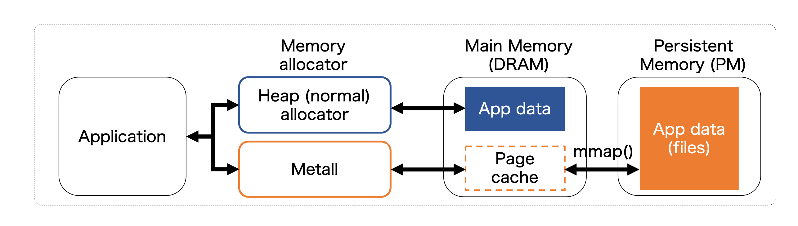

## Overview

Metall is a persistent memory allocator designed to provide developers with an API to allocate custom C++ data structures in both block-storage and
byte-addressable persistent memories (e.g., NVMe SSD and Intel Optane DC Persistent Memory).

Metall relies on a memory-mapped file mechanism ([mmap](http://man7.org/linux/man-pages/man2/mmap.2.html)),
to map a file in a filesystem into the virtual memory of an application,
allowing the application to access the mapped region as if it were regular memory.

Such mapped area can be larger than the physical main-memory of the system, allowing applications
to address datasets larger than physical memory (often referred to as out-of-core or external memory).

Metall incorporates state-of-the-art allocation algorithms in [SuperMalloc](https://dl.acm.org/doi/10.1145/2887746.2754178) with
the rich C++ interface developed by [Boost.Interprocess](https://www.boost.org/doc/libs/release/doc/html/interprocess.html),
and provides persistent memory snapshotting (versioning) capabilities.

Example programs that use Metall are listed [here](detail/example.md).




## Publication

[Metall: A Persistent Memory Allocator Enabling Graph Processing](https://www.osti.gov/servlets/purl/1576900)

```text
@INPROCEEDINGS{8945094,
author={K. {Iwabuchi} and L. {Lebanoff} and M. {Gokhale} and R. {Pearce}},
booktitle={2019 IEEE/ACM 9th Workshop on Irregular Applications: Architectures and Algorithms (IA3)},
title={Metall: A Persistent Memory Allocator Enabling Graph Processing},
year={2019},
pages={39-44},
doi={10.1109/IA349570.2019.00012},
month={Nov},}
```

IEEE Xplore [page](https://ieeexplore.ieee.org/document/8945094)