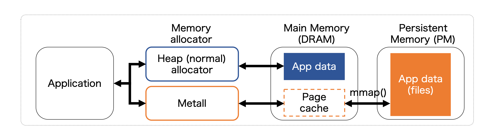

# Metall: Persistent Memory Allocator for Data-Centric Analytics

This site documents Metall, an open-source persistent memory allocator for C++.
The source repository is available on [GitHub](https://github.com/LLNL/metall).

## Overview

Metall provides an allocator-oriented API for building custom C++ data
structures on persistent storage, including block devices and byte-addressable
persistent memory.

Metall relies on the memory-mapped file mechanism
([mmap](http://man7.org/linux/man-pages/man2/mmap.2.html)) to map files into an
application's virtual address space, allowing the mapped region to be accessed
as if it were regular memory.

These mapped regions can be larger than physical memory, which allows
applications to work with out-of-core datasets.

Metall combines allocation techniques from
[SuperMalloc](https://dl.acm.org/doi/10.1145/2887746.2754178) with the C++
interface style of
[Boost.Interprocess](https://www.boost.org/doc/libs/release/doc/html/interprocess.html),
and it also provides snapshotting and versioning support for persistent data.

Example programs that use Metall are listed on the [Examples page](detail/example.md).

