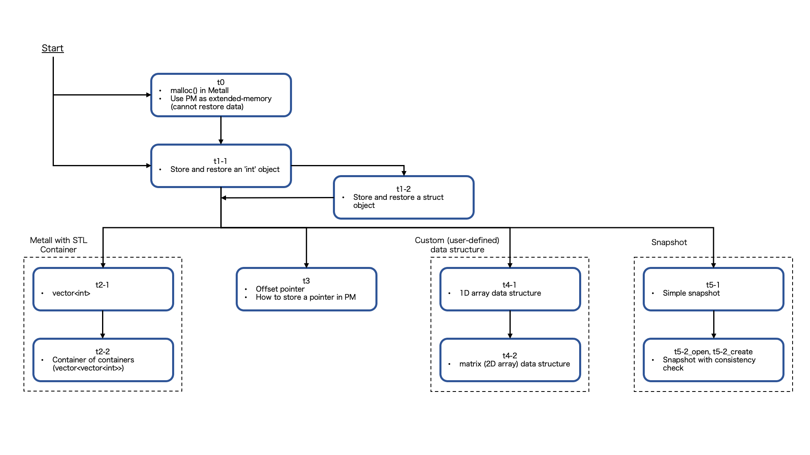
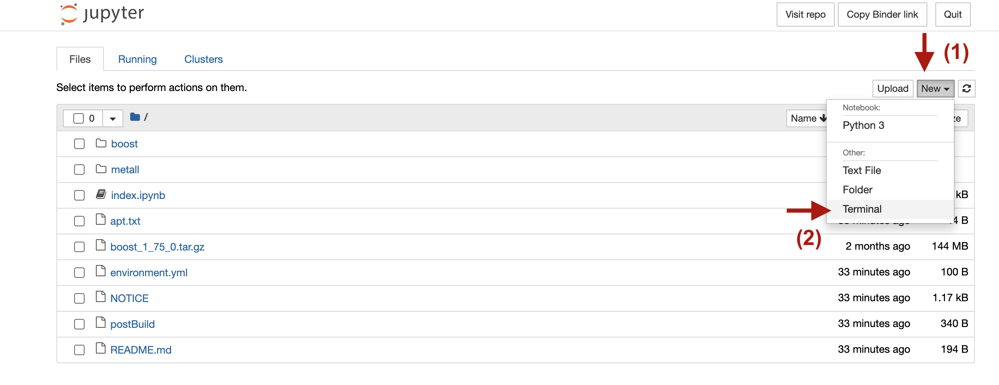

# Hands-on Examples

## Recommended Flow



---

# Run Examples on Binder

We set up an environment on [Binder](https://mybinder.org/) to experience the tutorial examples.
Although Binder is designed for providing executable environment for Jupyter notebooks,
one can use it for C/C++ programs.
In this hands-on, we use the terminal available on the system.

## 1. Launch Binder

Click the button below (recommend to open in a new tab/window):

[](https://mybinder.org/v2/gh/LLNL/metall-tutorial/HEAD)

Binder runs on Kubernetes, and it sometime takes more than a few minutes to launch.

## 2. Open a terminal on Binder

To open a terminal, click \[New\] -> \[Terminal\].




## 3. Build

Metall depends on Boost C++ Libraries and requires GCC 8.1 or more.
They are already installed in the home directory for you.

Here is how to build a tutorial example.

```bash
# Metall's git repository is available in the home directory.
cd $HOME/metall/tutorial/hands_on

# Build all examples
make

# All tutorial programs do not take command-line options.
# To run an executable, for example:
./t0

# --------------------------------------------- #
# Alternatively, manually build an example
g++-8 -std=c++17 [tutorial_example.cpp, e.g., t1-1.cpp] -lstdc++fs -pthread -I../../include -I$HOME/boost
./a.out
```

If one needs a code editor, Vim and Emacs are available on the system.  

----
# Run Examples on Your Own Environmental

Alternatively, here is how to set up an environment by yourself and run the examples.

## 1. Setup Environment

### 1-1. Machine

Metall is designed to work on Linux machines.
It also works on macOS (some internal performance optimizations are disabled).


***Google Cloud***

One also could use a public cloud system, such as [Google Cloud](https://cloud.google.com/).
Here is an example of creating an account on Google Cloud: [use_googlecloud.pdf](use_googleclould.pdf).


### 1-2. Compiler (GCC)

Install GCC 8.1 or more. One could also use Clang or Apple clang; however, GCC is recommended.

### 1-3. Boost C++ Libraries

Metall depends on  [Boost C++ Libraries](https://www.boost.org/) (1.80 or more is required).
Only the header files are used by Metall.
One **does not have to build** it.

Download Boost from [here](https://boostorg.jfrog.io/artifactory/main/release/1.80.0/source/boost_1_80_0.tar.gz) (a download process will start automatically)
and uncompress it (e.g., double-click the downloaded file).

Or, on a terminal:
```bash
# Download Boost C++ Libraries
wget https://boostorg.jfrog.io/artifactory/main/release/1.80.0/source/boost_1_80_0.tar.gz
tar xvf boost_1_80_0.tar.gz
```


## 2. Build and Run
 
```bash
# Download Boost C++ Libraries (1.80 or more is required)
# One can skip this step if Boost is already available
wget https://dl.bintray.com/boostorg/release/1.80.0/source/boost_1_80_0.tar.gz
tar xvf boost_1_80_0.tar.gz
export BOOST_ROOT=$PWD/boost_1_80_0

git clone https://github.com/LLNL/metall
cd metall/tutorial/hands_on
g++ -std=c++17 [tutorial_program.cpp] -lstdc++fs -I../../include -I${BOOST_ROOT}
# If one gets an error related to pthread, please add '-pthread' at the end of the command above

# All tutorial programs do not take command-line options
./a.out
```


### (optional) Build using Clang or Apple clang

Clang (or Apple clang) could be used instead of GCC to build Metall.
However, please note that we haven't tested it intensively.
To run on macOS, Metall requires macOS >= 10.15.

```bash
# Remove "-lstdc++fs" option
clang++ -std=c++17 [tutorial_program.cpp] -I../../include -I${BOOST_ROOT}
```