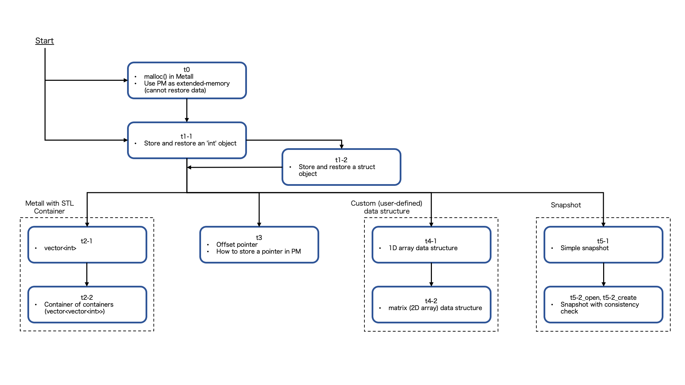

# 0. Setting Up Environment for the Hands-on Session

We recommend staring setting up one's environment before
the hands-on session because some steps may take a long time.

### Machine

Metall is designed to work on Linux machines.
It also works on macOS (some internal performance optimizations are disabled).


***Google Cloud***

One also could use a public cloud system, such as [Google Cloud](https://cloud.google.com/).
Here is an example of creating an account on Google Cloud: [use_googlecloud.pdf](use_googleclould.pdf).


### GCC

Please install GCC 8.1 or more. One could also use Clang or Apple clang; however GCC is recommended.

### Boost C++ Libraries

Only the header files are used by Metall. One does not have to build it.

```bash
# Download Boost C++ Libraries (1.80 or more is required)
wget https://dl.bintray.com/boostorg/release/1.80.0/source/boost_1_80_0.tar.gz
tar xvf boost_1_80_0.tar.gz
```

# 1. Lecture Materials

* [Metall 101 slides](metall_101.pdf)

# 2. Hands-on

## 2-1. Recommended Flow




## 2-2. Build and Run

**Required**

- GCC 8.1 or more

**Build example**
```bash
# Download Boost C++ Libraries (1.80 or more is required)
# One can skip this step if Boost is already available.
wget https://dl.bintray.com/boostorg/release/1.80.0/source/boost_1_80_0.tar.gz
tar xvf boost_1_80_0.tar.gz
export BOOST_ROOT=$PWD/boost_1_80_0

git clone https://github.com/LLNL/metall
cd metall/tutorial/nvmw21
g++ -std=c++17 [tutorial_program.cpp] -lstdc++fs -I../../include -I${BOOST_ROOT}

# All tutorial programs does not take command-line options
./a.out
```


## 2-3. (optional) Build using Clang or Apple clang

Clang (or Apple clang) could be used instead of GCC to build Metall.
However, please note that we haven't tested it intensively.
To run on macOS, Metall requires macOS >= 10.15.

```bash
# Remove "-lstdc++fs" option
clang++ -std=c++17 [tutorial_program.cpp] -I../../include -I${BOOST_ROOT}
```